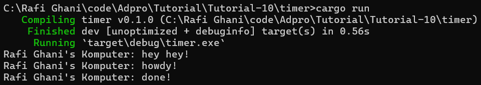

# TUTORIAL 10 ADPRO
#### Rafi Ghani Harditama (2206081364)
#### ADPRO A / VRO

## Understanding how it works

Dari gambar diatas, dapat dilihat bahwa output pertama yang muncul adalah `Rafi Ghani's Komputer: hey hey!` kemudian baru perintah yang berada di spawner muncul. Hal ini terjadi karena eksekusi tugas yang dijadwalkan `(spawner.spawn(...))` dilakukan secara asynchronous/tidak dijalankan saat itu juga. Jadi ketika `Rafi Ghani's Komputer: hey hey!` dijalankan,  executor belum mulai mengeksekusi tugas yang dijadwalkan, sehingga pesan tersebut muncul terlebih dahulu sebelum pesan dari tugas yang dijadwalkan.